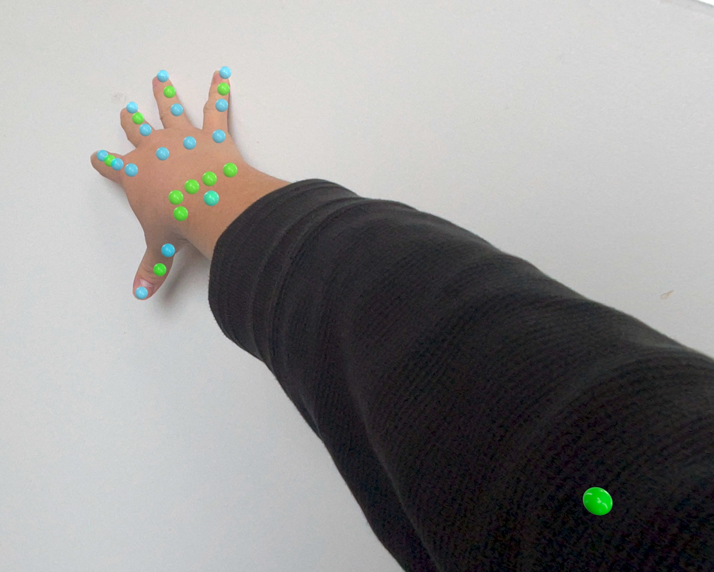

Quick Immersion on the Apple Vision Pro
===========

Example app for quickly toggling in and out of a Full Space, explained [here](https://andykong.org/blog/quickimmersion)

Contact
--------
https://andykong.org

Acknowledgements
--------
I started using the code from [here](https://github.com/FlipByBlink/HandsRuler).

More pictures
--------

### Start menu

### Both hand tracking, works with pretty weird poses too

### Elbow joint + hands

